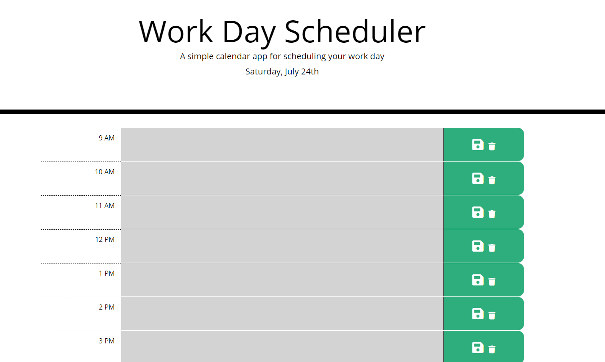

# Work-Day-Scheduler
This calendar app for scheduling your work day was designed to enhance my skills using 3rd party API's. This project used BootStrap and jQuery as well as moment.js to create a Work Day Scheduler.

## Built With
* HTML
* CSS
* BootStrap
* jQuery
* Moment.js

## Site Location
[Work Day Scheduler](https://github.com/ShannonDukes/Work-Day-Scheduler)

## Contribution
Made by [Shannon Dukes]

## Site Image

### ©️2021 Shannon Dukes